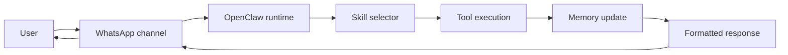
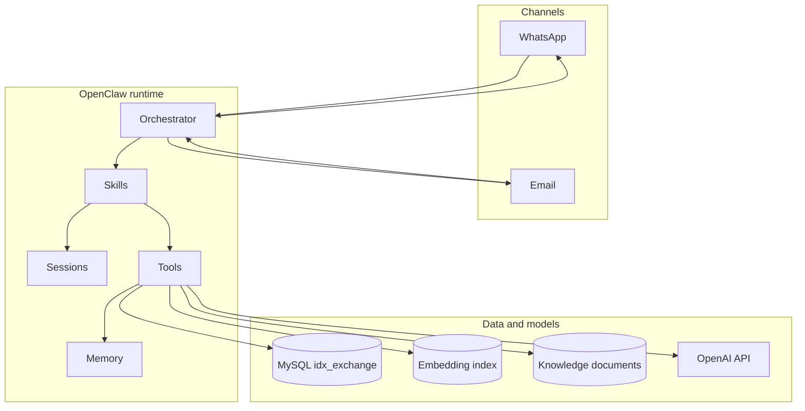
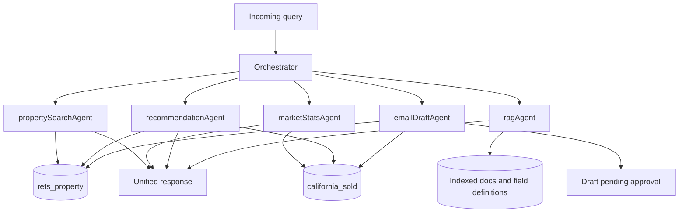
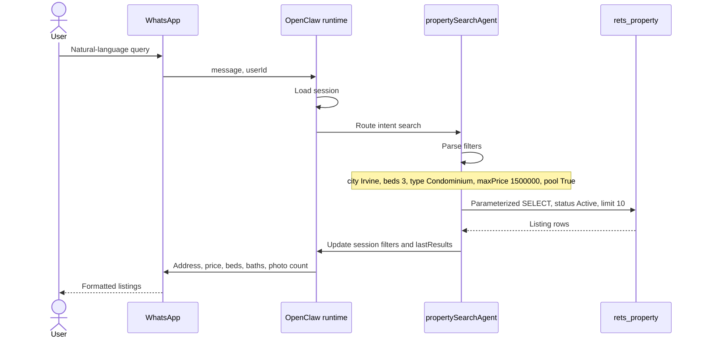

# Week 1 architecture notes

Week 1 is about getting the shape down before any of the skills exist. The assistant will live on WhatsApp, run on OpenClaw, and answer from the two MySQL tables imported in Week 0.

`rets_property` is the live inventory: about 228k active California listings, 130+ columns. This is what search, recommendations, and the remark embeddings read. `california_sold` is the history: about 439k closed transactions from 2021 through 2025, 46 columns. Comps and market stats come from there. Both tables sit in `idx_exchange`. The dump originally came from `boxgra5_cali`; locally we created a new database and loaded the two SQL files into it.

OpenClaw already handles channels, sessions, routing, and tool calls. We should not rebuild any of that. Our code is the skills, and the tools those skills call.

## How a message moves

Every later week should follow this path. The skills get more specific. The path stays the same.



Someone texts the WhatsApp number. OpenClaw receives it, figures out who sent it, and loads that person's session. The runtime then picks a skill. The skill calls a tool, and the tool is the thing that actually talks to MySQL or OpenAI. When the tool comes back, we save anything the next turn will need, format a reply, and send it out WhatsApp.

Email, in Week 11, uses this same path. The difference is that a draft gets shown to the user before anything is sent.

## Pieces

I want these kept separate, because they are easy to smash together once the code starts.

**Channel.** WhatsApp for now. Email later. This layer only moves messages in and out.

**Orchestrator.** Reads the message and picks a skill. A mixed question can hit two skills, then get stitched into one reply.

**Skill.** What the user is actually asking for: search, market stats, similar homes, a definition, or an email draft.

**Tool.** A normal async function. SQL, embeddings, and email drafts live here. Skills should not open their own database connections. If the parameter binding and the row limit sit in the tool, we only have to get them right in one place.

**Session.** State for the current conversation, keyed by user id. City, budget, beds, the last listings we showed, and which follow-up we asked last.

**Memory.** Two different stores. The session dies with the conversation. The vector index sticks around: listing embeddings, and later the RAG chunks.



## Which skill hits which table

None of these skills exist yet. This is the map so Week 2 does not invent a second way in.



Property search (Weeks 2–4) reads `rets_property` and writes the filters plus `lastResults` onto the session.

Market stats (Week 5) aggregates `california_sold`. Nothing to store after the reply goes out.

Recommendations (Weeks 6–7) score active listings, then check the price against recent sold comps.

The RAG skill (Week 8) answers from indexed docs: field definitions, a glossary, market writeups. A question like "what does DOM mean?" should not turn into a listing query.

Email (Week 11) only drafts. It uses results the other skills already produced, and the draft sits at `pending_approval` until the user confirms.

Once the orchestrator is real, the intent labels are `search`, `market`, `recommend`, `knowledge`, and `mixed`. "Find me affordable homes in Pasadena and tell me if prices are rising" is the mixed case: property search and market stats run together, then one reply.

## A search, end to end

Take "Show me 3-bedroom condos in Irvine under $1.5M with a pool."



Week 2 turns that sentence into a filter object. Week 3 binds the values as SQL parameters. Week 4 is the messier version, where the user says "homes in Irvine" and we have to ask for budget and property type before running anything.

The `rets_property` column names do not match the words users say, so here is the mapping I am using:

- city → `L_City`
- max price → `L_SystemPrice`
- bedrooms → `L_Keyword2` (just an int; the name does not say bedrooms)
- bathrooms → `LM_Dec_3` (this one can be 2.5)
- sqft → `LM_Int2_3`
- property type → `L_Type_` (`Condominium`, `SingleFamilyResidence`, and so on)
- pool → `PoolPrivateYN`
- view → `ViewYN`
- max HOA → `AssociationFee`

Active search always adds `L_Status = 'Active'`. Page size 10. Hard stop at 50 rows. The handbook is explicit about that cap, and it applies to comps queries too.

Linking an active listing to its sold record:

```sql
CAST(rets_property.L_ListingID AS UNSIGNED) = california_sold.ListingKey
```

`L_ListingID` is a varchar and `ListingKey` is a bigint, so the cast is required. For a market question ("how is Irvine doing") we skip this join and match on city or ZIP.

### The other question types

"What is the average price per sqft in Pasadena?" goes to `marketStatsAgent`. Aggregate `california_sold` for that city, `PropertyType = 'Residential'`, trailing 12 months unless the user asks for something else. The reply should cover close price, days on market, list-to-close ratio, and the 12-month trend. No session filters involved.

If the user already has a listing in `lastResults` and asks for similar homes, `recommendationAgent` scores other active rows on price, beds, city, and sqft, plus cosine similarity on the listing embeddings. Then it checks that price against recent comps in the same city, in a band around the listing's square footage. Top 5, with how far the list price sits from those comps.

"What does DOM mean?" goes to `ragAgent`. Embed the question, pull a few chunks, answer from those chunks. Sources are the field definitions, the glossary, and market summaries from the stats skill.

## Session vs embeddings

Session is a map on `userId`. I am planning to keep `city`, `maxPrice`, `beds`, `baths`, `type`, `pool`, `lastResults`, and `conversationStep`. A follow-up like "single family, at least 3 beds" updates that same object and runs the search again. `clearSession` drops it.

Embeddings are a different store. Build them from the listing text (type, city, beds, baths, sqft, year, price, and `L_Remarks`) ahead of time, so a query does not re-embed 228k rows. Refresh when `ModificationTimestamp` moves, or just rerun the batch. RAG chunks use the same idea with different content.

## Guardrails

Putting these in now so they are not a Week 11 surprise.

Email is draft first. `draftEmail` returns `pending_approval`. `sendApprovedEmail` is the only function that talks to SMTP, and it runs after the user confirms.

Secrets stay in `.env`: `OPENAI_API_KEY`, the `MYSQL_*` variables, `EMAIL_USER`, `EMAIL_PASSWORD`. They do not go in logs.

Every listing or comps query takes a bound `LIMIT`, max 50. We are not exporting the MLS through the agent.

The MySQL user the tools connect with should be read-only on these two tables. The agent can read. It should not update listings, and it should not send mail on its own.

## What is running locally

Week 0 left us with OpenClaw (Node) linked to WhatsApp, MySQL on localhost with `idx_exchange`, and a Python venv for the tools. OpenClaw calls into Python for SQL and embeddings. Python calls OpenAI.

`.env.example` already has the variable names. `requirements.txt` covers the tool side: `openai`, `mysql-connector-python`, `SQLAlchemy`, `pandas`, `numpy`, `scikit-learn`.

## After this week

Week 2 is the filter parser. Week 3 is the parameterized search and comps queries. Week 4 adds the session follow-ups. Week 5 is market stats. Week 6 builds the embedding index. Week 7 is recommendations with the comp check. Week 8 is RAG. Week 9 is the orchestrator, including mixed questions. Week 10 formats replies for WhatsApp. Week 11 is the email draft and the approval gate. Week 12 is the demo.

This week is just the path. Skills start next week.
