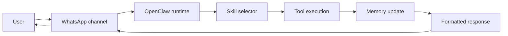
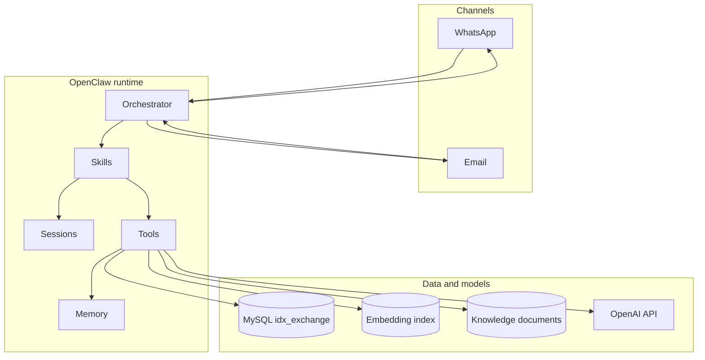
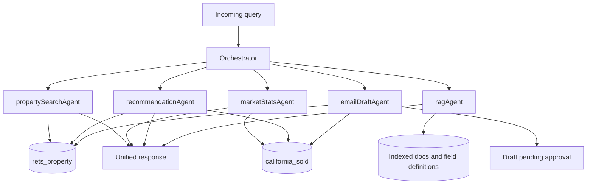
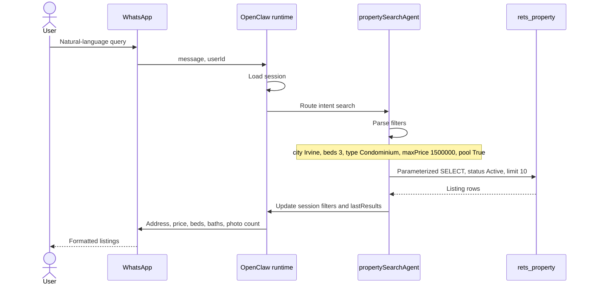
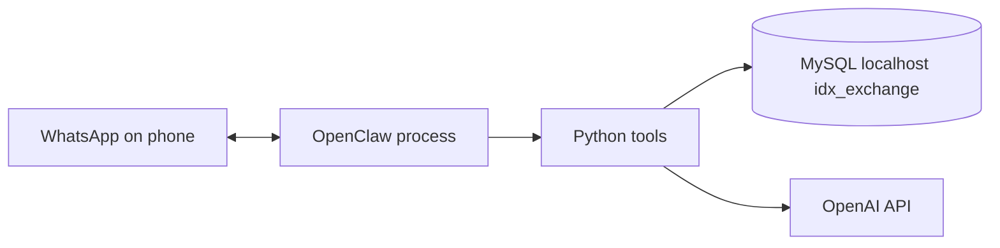

# Week 1 — OpenClaw Architecture

Architecture for the IDX Exchange multi-agent assistant. This document is the Week 1 deliverable: how a user query moves from WhatsApp through the OpenClaw runtime and skills to the MLS databases, and how the response comes back.

Later weeks implement the skills. This document fixes the shape they plug into.

## 1. What the system is

A production assistant over two California MLS tables in MySQL database `idx_exchange`:

| Table | Role | Scale |
| --- | --- | --- |
| `rets_property` | Active listings. Search, discovery, recommendations, embeddings over `L_Remarks`. | ~228K rows, 130+ fields |
| `california_sold` | Closed transactions. Comps, market stats, price validation. | ~439K rows, 46 fields |

The runtime is [OpenClaw](https://github.com/openclaw/openclaw). It owns channels, sessions, skill routing, tool execution, and memory. Application code is skills and typed tools. It does not reimplement chat transport or session storage.

Source data originally lives in schema `boxgra5_cali`. Local development uses `idx_exchange`, created in Week 0. Join active listings to sold comps with:

```sql
CAST(rets_property.L_ListingID AS UNSIGNED) = california_sold.ListingKey
```

City and postal code are the join for market-level analysis when a listing-level key is not required.

## 2. Request path

Every user turn follows one path. Skills and tools change. The path does not.



| Step | What happens |
| --- | --- |
| User | Sends a natural-language message, or confirms an outbound action such as an email. |
| WhatsApp channel | OpenClaw receives the message, identifies the sender, and attaches it to that user's session. |
| Runtime | Loads session state, available skills, and tool schemas. Does not query MySQL itself. |
| Skill selector | Classifies intent and picks one skill, or several skills for a mixed query. |
| Tool execution | The skill calls typed tools. Tools run parameterized SQL, embeddings, or a draft-only email. |
| Memory update | Session preferences and the latest result set are written back. Vector memory is updated only when a skill indexes or retrieves embeddings. |
| Response | The skill returns a structured result. The channel formats it for WhatsApp and sends it. |

Email is a second channel with the same runtime path, plus an approval gate before any send. See [Safety constraints](#7-safety-constraints).

## 3. Runtime components



| Component | Responsibility | Owns |
| --- | --- | --- |
| Channel | Ingress and egress. WhatsApp is the primary interface. Email is draft-then-approve. | Message transport only |
| Orchestrator | Classifies intent and routes to one or more skills. Merges parallel results. | Routing decision |
| Skill | One user-facing capability: search, market stats, recommendations, RAG, or email draft. | Prompt, tool choice, response shape |
| Tool | A typed async function. SQL, embeddings, and email drafts live here. | Side effects, with the guardrails below |
| Session | Per-user conversation state for the current thread. | City, budget, beds, last results, step |
| Memory | Short-term session state plus long-term vector storage for remarks and RAG chunks. | What the next turn can recall |

Skills do not open database connections. Tools do. That keeps SQL, pagination, and row limits in one place.

## 4. Skills and the databases they touch

Week 1 does not implement these skills. The diagram is the target map so each later week has a single place to land.



| Skill | Week | Reads | Writes |
| --- | --- | --- | --- |
| `propertySearchAgent` | 2–4 | `rets_property` filtered listings | Session filters and `lastResults` |
| `marketStatsAgent` | 5 | `california_sold` aggregates | Nothing persistent |
| `recommendationAgent` | 6–7 | `rets_property` plus sold comps for price check | Nothing persistent |
| `ragAgent` | 8 | Chunk index built from field definitions and glossary | Index at build time only |
| `emailDraftAgent` | 11 | Results already produced by the other skills | A draft with status `pending_approval` |

Intent labels the orchestrator uses once all skills exist: `search`, `market`, `recommend`, `knowledge`, `mixed`. A mixed query such as "affordable homes in Pasadena and are prices rising" runs `propertySearchAgent` and `marketStatsAgent` in parallel, then merges the two results into one reply.

## 5. Workflow walkthrough

### Property search

User: "Show me 3-bedroom condos in Irvine under $1.5M with a pool."



The parser (Week 2) turns text into a filter object. The query tool (Week 3) binds those values as SQL parameters. The conversational layer (Week 4) asks for missing filters and stores them on the session instead of requiring the full query in one message.

Filters map to `rets_property` as follows.

| Filter | Column |
| --- | --- |
| City | `L_City` |
| Max price | `L_SystemPrice` |
| Min bedrooms | `L_Keyword2` |
| Min bathrooms | `LM_Dec_3` |
| Min square feet | `LM_Int2_3` |
| Property type | `L_Type_` |
| Pool | `PoolPrivateYN` |
| View | `ViewYN` |
| Max HOA | `AssociationFee` |

Active search always includes `L_Status = 'Active'` and `LIMIT` / `OFFSET`. Default page size is 10. Hard cap is 50 rows.

### Market question

User: "What is the average price per square foot in Pasadena?"

The orchestrator routes to `marketStatsAgent`. The tool aggregates `california_sold` for that city over a trailing window (default 12 months), restricted to `PropertyType = 'Residential'`. The reply includes median or average close price, days on market, list-to-close ratio, and the 12-month trend. No session filters are required.

### Recommendation

User has a listing in `session.lastResults` and asks for similar homes.

`recommendationAgent` scores other active rows in `rets_property` with structured features (price, beds, city, square feet) plus cosine similarity on embeddings of listing text. It then checks the suggested price against recent `california_sold` comps in the same city and a square-footage band. The reply is the top 5 listings plus a comp delta.

### Knowledge question

User: "What does DOM mean?"

`ragAgent` embeds the question, retrieves the top chunks from the document index, and answers from that context only. Sources are MLS field definitions, the terminology glossary, and market summaries produced by the analytics skill. This path does not query listing rows.

## 6. Memory

Two stores, different lifetimes.

| Store | Lifetime | Contents | Used by |
| --- | --- | --- | --- |
| Session | One conversation, keyed by `userId` | `city`, `maxPrice`, `beds`, `baths`, `type`, `pool`, `lastResults`, `conversationStep` | Search and recommendation follow-ups |
| Vector index | Persistent across sessions | Listing embeddings from `L_Remarks` and structured fields; RAG chunks | Semantic search, recommendations, knowledge answers |

Session state is required before multi-turn search works. A follow-up ("single family, at least 3 beds") updates the same session and re-runs the listing tool. `clearSession` drops that state.

Vector memory is not the session. Embeddings are built offline or on a sync from `ModificationTimestamp`, then read at query time.

## 7. Safety constraints

These rules are part of the architecture, not a later patch.

| Rule | Where it is enforced |
| --- | --- |
| No email is sent without an explicit user confirmation | `draftEmail` returns `pending_approval`. `sendApprovedEmail` runs only after confirmation. |
| Secrets stay in `.env` | Tools read `OPENAI_API_KEY`, `MYSQL_*`, and `EMAIL_*` from the environment. Logs never include them. |
| No bulk export of MLS data | Every listing or comps query uses a bound `LIMIT`. Maximum 50 rows. |
| Outbound and destructive actions need a person | The orchestrator may draft. It may not send, delete, or write back to MLS tables. |

The MySQL account used by tools is read-only on `rets_property` and `california_sold`.

## 8. Deployment view for local development

Week 0 produces this process layout. Week 1 does not add services beyond it.



Environment variables, matching `.env.example`:

| Variable | Use |
| --- | --- |
| `OPENAI_API_KEY` | Chat completions and embeddings |
| `MYSQL_HOST`, `MYSQL_USER`, `MYSQL_PASSWORD`, `MYSQL_DATABASE` | Pool for both MLS tables. Database is `idx_exchange`. |
| `EMAIL_USER`, `EMAIL_PASSWORD` | SMTP for approved email only |

Python dependencies already pinned in `requirements.txt` cover the tool side: `openai`, `mysql-connector-python`, `SQLAlchemy`, `pandas`, `numpy`, `scikit-learn`. OpenClaw itself is the Node runtime installed in Week 0.

## 9. Week map

Each week adds a skill or a channel behavior. None of them replace the request path in section 2.

| Week | Adds |
| --- | --- |
| 0 | OpenClaw, MySQL import, WhatsApp login, `.env` |
| 1 | This architecture |
| 2 | Filter parser inside `propertySearchAgent` |
| 3 | Parameterized search and comps tools |
| 4 | Session memory and follow-up questions |
| 5 | `marketStatsAgent` |
| 6 | Listing embedding index and cosine search |
| 7 | `recommendationAgent` with comp validation |
| 8 | `ragAgent` and the document index |
| 9 | Orchestrator over all five skills, including mixed intent |
| 10 | WhatsApp formatting in front of `orchestrate()` |
| 11 | `emailDraftAgent` and the approval gate |
| 12 | Capstone demo of the full path |

## 10. Week 1 boundary

Documented now:

- The single request path from WhatsApp through the runtime to MySQL and back.
- Component boundaries: channel, orchestrator, skill, tool, session, memory.
- Which skill reads which table.
- The session versus vector memory split.
- The row cap, read-only database role, and email approval gate.

Not built in Week 1:

- Skill implementations, SQL modules, embedding indexes, and the orchestrator `switch`.
- WhatsApp formatting and the email transporter.

Those land in the weeks listed above, behind the boundaries in this document.
